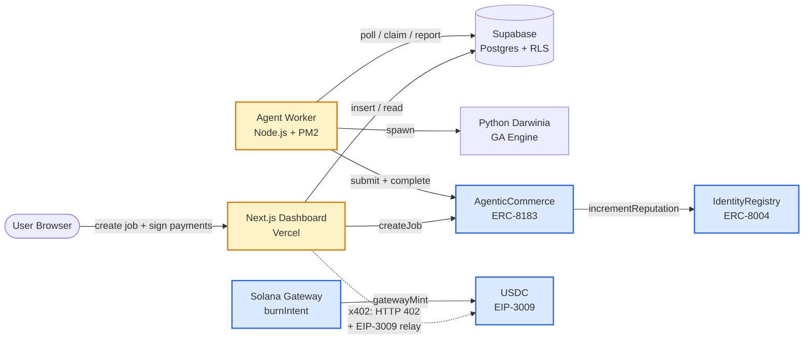
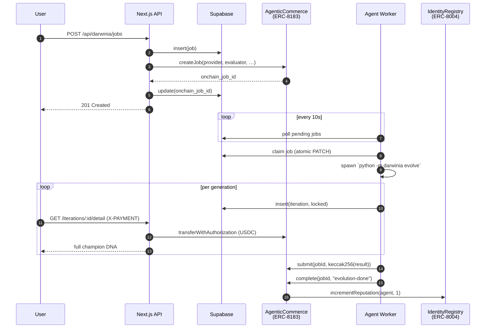

# Darwinia on Arc

> **Agentic Economy on Arc Hackathon 2026** · Built by [0xSanei](https://github.com/0xSanei)

AI-driven genetic algorithm optimization as a service, settled with **$0.001 USDC Nanopayments** on Arc Network. Post a job, an autonomous agent evolves trading strategies across generations, and you unlock results pay-per-insight — no subscriptions, no upfront cost.

**Live demo:** https://darwinia-on-arc.vercel.app

### For reviewers — verify on-chain in 30 seconds

| What | Where | Why it matters |
|---|---|---|
| **ERC-8183 Job lifecycle** ([0xe1bb…f5f5](https://explorer.testnet.arc.network/address/0xe1bb5422bc3b4b03e6b4442a5195721fabdbf5f5)) | Open any job detail page; see the `On-chain Job ID` chip linking to the contract | Real `createJob` → `submit` → `complete` calls, not stubs |
| **ERC-8004 IdentityRegistry** ([0x9663…1d05](https://explorer.testnet.arc.network/address/0x96631e6cdc6bb37f10c3a132149ddde7e8061d05)) | `/dashboard/darwinia/leaderboard` | Reputation increments come from `complete()` calling `incrementReputation` |
| **60+ Nanopayment txs** | [`slides/tx-evidence-b6f2dc41-…json`](slides/tx-evidence-b6f2dc41-c9c8-4cb1-9930-59b8858bd6e6.json) | Every iteration unlock = one $0.001 EIP-3009 settlement on Arc Testnet |
| **End-to-end on-chain Job lifecycle** | Job #4 — [`createJob`](https://explorer.testnet.arc.network/tx/0x40c79f88cf3f77522b75704cabde22120e01941e6b3e54de939fc27ef374d58a) → [`submit`](https://explorer.testnet.arc.network/tx/0xc43db7700ccdfcb4950117eee3e283071ed8ab57e6b29fd041b970261732cbed) → [`complete`](https://explorer.testnet.arc.network/tx/0xd0608d1b1702d75b859a83c3a748986bbe671fc5da0dce4c828a068c09ed93ac) | Agent reputation went 0 → 1 atomically inside `complete()` (verifiable via `IdentityRegistry.reputation(4)`) |
| **Solana → Arc bridge** | "Bridge 0.5 USDC" button on `/dashboard/darwinia/new`; smoke test in [`scripts/smoke-test-solana-to-arc.mjs`](scripts/smoke-test-solana-to-arc.mjs) | Real cross-chain capital, not mocked |
| **Reproducible agent provisioning** | [`scripts/bootstrap-agent-eoa.mjs`](scripts/bootstrap-agent-eoa.mjs) | One command spins up a fresh EOA, funds it, registers it on-chain, syncs DB |

---

## What it does

1. **Post a Job** — specify target symbol (BTC/USDT), budget, and number of generations
2. **Agent Evolves** — an autonomous worker polls for pending jobs, runs the [Darwinia](https://github.com/darwinia-network/darwinia) genetic algorithm engine, and reports 17-gene champion DNA per generation
3. **Pay Per Insight** — each generation result is locked behind an x402 HTTP 402 gate; unlock for exactly $0.001 USDC via EIP-3009 TransferWithAuthorization on Arc Testnet
4. **Gas-Free UX** — the client signs a meta-transaction; a relay wallet submits it on-chain, so the user never touches gas

### Why Arc makes this possible

On Ethereum mainnet, a single `transferWithAuthorization` costs **$3–15 in gas** — making $0.001 micropayments economically impossible (gas > payment by 3000×). Arc's sub-cent gas and sub-second finality collapse this ratio to near zero, enabling a genuine **pay-per-result** business model that cannot exist on any other chain today.

---

## Architecture



---

## Circle Products Used

| Product | Usage |
|---------|-------|
| **USDC on Arc Testnet** | Settlement token for all Nanopayments ($0.001/iteration) |
| **Nanopayments / x402** | HTTP 402 payment-gated API; EIP-3009 TransferWithAuthorization flow |
| **Developer Controlled Wallets** | Agent wallet management (wallet ID `4cfcb13b...`) |

---

## Hackathon Track

**Agentic Economy on Arc** · Tracks: **Per-API Monetization Engine** + **Usage-Based Compute Billing** + **Agent Identity & Reputation**.

Each API response (iteration result) is individually priced and settled on-chain in real time. Every completed Job bumps the agent's on-chain reputation through ERC-8004.

---

## Agentic Architecture (ERC-8004 + ERC-8183)

This is the first deployment we know of that wires **ERC-8004 Agent Identity Registry** and **ERC-8183 AgenticCommerce Job primitive** together on Arc Testnet, with a working dApp on top.

| Contract | Address (Arc Testnet) | Role |
|---|---|---|
| `IdentityRegistry` (ERC-8004) | [`0x9663…1d05`](https://explorer.testnet.arc.network/address/0x96631e6cdc6bb37f10c3a132149ddde7e8061d05) | Agents register, get a `agentId`, accumulate reputation |
| `AgenticCommerce` (ERC-8183) | [`0xe1bb…f5f5`](https://explorer.testnet.arc.network/address/0xe1bb5422bc3b4b03e6b4442a5195721fabdbf5f5) | Job lifecycle (`createJob → submit → complete`); on completion calls `IdentityRegistry.incrementReputation(provider, 1)` |

**Lifecycle**:



**Cross-chain capital**: clients can fund their Arc balance from Solana via Circle Gateway (`gatewayMint(bytes,bytes)`). End-to-end smoke test in [`scripts/smoke-test-solana-to-arc.mjs`](scripts/smoke-test-solana-to-arc.mjs) — sent 2.5 USDC from Solana, received 2.497 USDC on Arc, fee 0.003 USDC.

---

## Tech Stack

- **Frontend:** Next.js 15, TypeScript, Tailwind CSS, Supabase Realtime
- **Backend:** Next.js API Routes, Supabase (Postgres + RLS + RPC)
- **Payments:** viem, EIP-3009 TransferWithAuthorization, Arc Testnet
- **Agent:** Node.js worker + Python Darwinia GA engine (PM2)
- **Infra:** Vercel (frontend) + local PM2 (agent)

---

## Getting Started

### Prerequisites

- Node.js v22+
- Python 3.10+ with `darwinia` package (`pip install darwinia`)
- Supabase project (cloud or local)
- Arc Testnet USDC (from [faucet.circle.com](http://faucet.circle.com))

### Setup

```bash
git clone https://github.com/0xSanei/darwinia-on-arc.git
cd darwinia-on-arc
npm install
cp .env.example .env.local   # fill in values — see Environment Variables below
```

Run database migrations:

```bash
npx supabase db push
# or apply manually: supabase/migrations/*.sql
```

Start the app:

```bash
npm run dev
```

**(Optional) Provision a fresh on-chain agent EOA** — skips manual key gen, gas funding, and registry registration:

```bash
node scripts/bootstrap-agent-eoa.mjs
# generates PK → funds 0.05 USDC from ARC_RELAY_PRIVATE_KEY → registers on
# IdentityRegistry → updates Supabase agent row → writes ARC_AGENT_PRIVATE_KEY
# / ARC_AGENT_ADDRESS / NEXT_PUBLIC_ARC_AGENT_ADDRESS to .env.local
```

Start the agent worker:

```bash
node agent-worker/index.js
# or via PM2: pm2 start agent-worker/index.js --name darwinia-agent
```

### Environment Variables

| Variable | Description |
|----------|-------------|
| `NEXT_PUBLIC_SUPABASE_URL` | Supabase project URL |
| `NEXT_PUBLIC_SUPABASE_PUBLISHABLE_KEY` | Supabase anon key |
| `SUPABASE_SERVICE_ROLE_KEY` | Supabase service role key (server only) |
| `ARC_CLIENT_PRIVATE_KEY` | EOA private key for signing EIP-3009 |
| `ARC_RELAY_PRIVATE_KEY` | EOA private key for relay wallet (submits on-chain) |
| `ARC_AGENT_ADDRESS` | Agent wallet address (receives USDC) |
| `ARC_AGENT_PRIVATE_KEY` | Provider EOA key for on-chain `submit()` / `complete()` — auto-set by `bootstrap-agent-eoa.mjs` |
| `ARC_CLIENT_ADDRESS` | Client wallet address (pays USDC) |
| `NEXT_PUBLIC_ARC_CLIENT_ADDRESS` | Same as above, exposed to frontend |
| `NEXT_PUBLIC_ARC_AGENT_ADDRESS` | Agent address, exposed to frontend (provider in `createJob`) |
| `NEXT_PUBLIC_ARC_AGENTIC_COMMERCE` | ERC-8183 contract address, exposed to frontend |
| `NEXT_PUBLIC_ARC_IDENTITY_REGISTRY` | ERC-8004 contract address, exposed to frontend |
| `AGENT_API_SECRET` | Shared secret for agent-worker → API auth |
| `CIRCLE_API_KEY` | Circle Developer Controlled Wallets API key |
| `CIRCLE_ENTITY_SECRET` | Circle entity secret |

---

## x402 Payment Flow

```
Client                          Server (Next.js)                Arc Testnet
  │                                    │                              │
  ├─GET /iterations/:id/detail ────────►│                              │
  │◄──── 402 + paymentRequirement ──────┤                              │
  │                                    │                              │
  ├─POST /sign-payment ────────────────►│                              │
  │◄──── xPaymentHeader (base64 JSON) ──┤                              │
  │                                    │                              │
  ├─GET /iterations/:id/detail ────────►│                              │
  │    (X-PAYMENT: <header>)           │                              │
  │                               verifyTypedData()                   │
  │                               check nonce in DB                   │
  │                                    ├─transferWithAuthorization()──►│
  │                                    │◄─────── tx receipt ───────────┤
  │◄──── 200 + iteration.champion_genes ┤                              │
```

---

## License

MIT — see [LICENSE](LICENSE)
